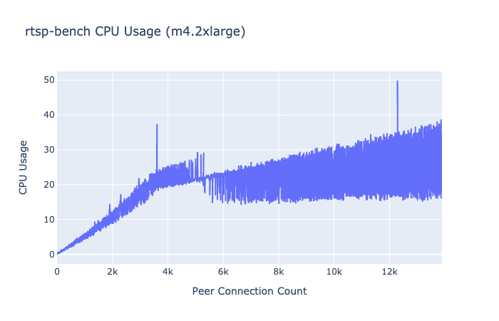

<h1 align="center">
  <a href="https://pion.ly"></a>
  <br>
  RTSP Bench
  <br>
</h1>
<h4 align="center">RTSP Server that generates usage reports, Web/CLI Clients included!</h4>
<p align="center">
  <a href="https://pion.ly"></a>
  <a href="https://pion.ly/slack"></a>
  <br>
  <a href="LICENSE"></a>
</p>
<br>

`rtsp-bench` is a WebRTC server that pulls from an RTSP feed, and then re-distributes via WebRTC. It generates a `report.csv` with the CPU Usage and connected PeerConnection count.

This repo contains a CLI WebRTC Client that will connect and perform the load test. This is done via a REST API hosted on `:8080/doSignaling`. You can also watch the video/load test via the web UI at `:8080/`,
it connects via the same REST API as the CLI.

This project heavily borrows from [RTSPtoWebRTC](https://github.com/deepch/RTSPtoWebRTC). If you are looking for a full featured application to deploy that is probably a better choice. It is driven by a config file and
has proper error handling.

### Running
* `export GO111MODULE=on`
* `git clone https://github.com/pion/rtsp-bench.git`
* `cd rtsp-bench/server`
* `go run main.go`

You can then access the Web UI at [http://localhost:8080](http://localhost:8080). This requires a browser that supports H264, this repo doesn't do any error handling around signaling failures.

You can also use the provided WebRTC CLI
* `cd rtsp-bench/client`
* `go run main.go localhost:8080`

In the server folder you will have a `reports.csv` that looks like

```
peerConnectionCount, cpuUsage
1, 17.878028
0, 35.101254
1, 12.565718
1, 20.600500
1, 17.878028
0, 41.795438
0, 37.083333
```

### Results
The following graph was generated from the `results.csv` that was generated by the server. The client was run from another EC2 instance in the same VPC.
The Y Axis is the CPU Usage, and the X Axis is the count of PeerConnections. This was run on a `m4.2xlarge (Intel(R) Xeon(R) CPU E5-2686 v4 @ 2.30GHz)`



### FAQ
#### What codec/bitrate was being distributed
H264 that is approximately 250 Kb/s. You can change that [here](https://github.com/pion/rtsp-bench/blob/c457c441237c2e58e3390c8175b53001ba6336d9/server/main.go#L124)

#### What SRTP Cipher was used
SRTP_AEAD_AES_128_GCM

#### What Congestion Control/Feedback is used
None, on purpose.

Pion by design allows the user to specify what they want. We are distributing a video feed that is already encoded, and has a very small keyframe-interval so these things don't help us.

When setting up the PeerConnection you have full control of the RTP/RTCP pipelines, so users can add TWCC/NACK/FEC in a way that works for them.

#### I want to talk about cool WebRTC stuff!
Join the [Pion Slack](https://pion.ly/slack)

### Community
Pion has an active community on the [Golang Slack](https://invite.slack.golangbridge.org/). Sign up and join the **#pion** channel for discussions and support. You can also use [Pion mailing list](https://groups.google.com/forum/#!forum/pion).

We are always looking to support **your projects**. Please reach out if you have something to build!

If you need commercial support or don't want to use public methods you can contact us at [team@pion.ly](mailto:team@pion.ly)

### License
MIT License - see [LICENSE](LICENSE) for full text
